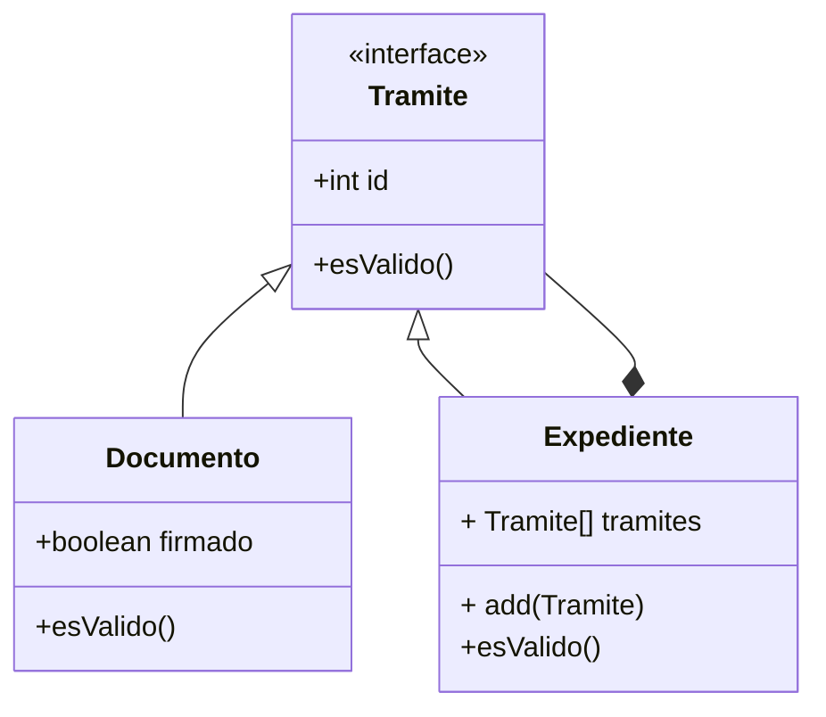

# Expeditivo

Un modelito para procesar tramites a partir de documentos sencillos y expedientes.

## Presentación

Para realizar trámites la universidad trabaja con documentos y expedientes.

Por ejemplo si necesitamos pedir un certificado de alumno regular se presenta un documento. Este pasa por distintas etapas y te lo devuelven.

Ahora cuando uno quiere tramitar el titulo tiene que crear un expediente con varios documentos e incluso otros expedientes, como por ejemplo si ingresamos por equivalencias con otra carrera.

Los expedientes y los documentos tienen un id único.

Un expediente se compone de documentos y puede contener otros sub expedientes más sencillos, pero que se comportan de la misma manera que los expedientes normales.

Un trámite es válido cuando se encuentra firmado. En el caso de los documentos, basta con que estén firmados. Para los expedientes requerimos que todos los documentos y sub-expedientes que lo componen sean válidos.

Tenemos un objeto mesa de entradas q recibe un documento o una carpeta y nos devuelve un id.

Al recibirlo se valida que lo entregado por el solicitante esté correcto. En un caso el documento individual y en el caso de los expedientes se validan los elementos que lo componen uno a uno, y si todos están bien se considera válido el expediente. Pensar que objetos usaríamos, que estructura nos conviene.

## Solución propuesta

Utilizamos el patrón composite.

## Diagrama de clase sencillo del Composite

     
